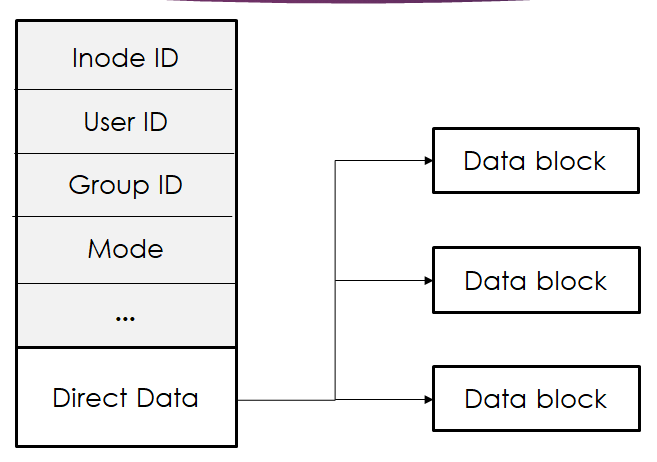

# Secured Ramdisk FileSystem With FUSE
## Overview
 <p align="justify">
  Proiectul își propune crearea unui sistem de fișiere folosind API-ul FUSE. Acesta reprezintă practic liantul dintre user-space și kernel-space și ne permite nouă, utilizatorilor neprivilegiați, să creăm un sistem de fișiere fără a modifica codul din kernel și de a lucra într-o manieră sigură.
 </p>
 <p align="justify">
   Pentru implementare, vom folosi un singur fișier mare ca emulator pentru un disc orientat pe blocuri folosit pentru stocare astfel încât să asigurăm persistența sistemului după demontare. Acest document explică arhitectura si organizarea aleasă, modul de legare a părților componente și observațiile relevante în dezvoltarea sistemului.
 </p>
  <p align="justify">
   În plus, pentru a mări gradul de securitate al aplicației, am decis ca sistemul nostru de fișiere să aibă toate datele criptate. Astfel, vom putea avea acces la fișiere numai prin intermediul filesystem-ului nostru căruia îi revine și rolul de a decripta datele citite și a le cripta la loc în momentul scrierii. Se va hotărî ulterior dacă vom permite doar unui utilizator privilegiat accesul la conținutul fișierelor sau dacă acest lucru se va realiza în momentul montării, dupa furnizarea unei parole.
 </p>
 
## Scopul Proiectului
   <p align="justify">
 Scopul nostru este de a realiza un sistem de fișiere simplu, rapid și eficient pentru stocarea și prelucrarea fișierelor și directoarelor, precum și obținerea unor cunoștințe practice despre elementele interne și conceptele necesare dezvoltării unui sistem de fișiere în Linux. 
   </p>
   
 ## Arhitectura si organizarea
  <p align="justify">
  Sistemul de fișiere va fi creat în memorie sub forma unui bloc de 1MO, iar aceasta zona continua va fi gestionata folosind structuri de date specializate (bitmapuri, inoduri, blocuri de date etc). În loc să citească și să scrie blocuri pe disc, sistemul va folosi memoria principală pentru stocare (RAMDISK). Pentru ca datele să nu se piardă atunci când procesul s-ar termina și memoria ar fi eliberată, la demontare vom salva datele(metadatele și datele reale) pe disc printr-un singur fișier binar extern (disk image) care va fi citit și încărcat în memoria RAM la fiecare pornire a sistemului (la fiecare montare), actualizând structurile de date folosite în consecință. În cazul în care nu există un astfel de fișier, vom porni un sistem nou(gol). 
     </p>
     <p align="justify">
  Cum un sistem de fișiere controlează modul în care datele sunt stocate și preluate pentru prelucrare sau afișare, acesta trebuie să asigure o modalitate de a determina unde se oprește o informație și unde începe următoarea. Distingem astfel două aspecte importante:
      </p>
      <p align="justify">
  
  1. Structurile de date folosite: tipurile de structuri de pe disc utilizate de sistemul de fișiere pentru a-și organiza datele și metadatele (e.g. blocurile de date, inode-urile, bitmap-urile, dentry-uri etc.);

  2. Accesul la date: cum se mapează apelurile efectuate de un proces pe structurile sale de date (cum manipulează diferite apeluri de sistem datele respective).

   </p>
   
### Structura sistemului de fișiere
 <p align="justify">
 Sistemul de fișiere implică 5 blocuri majore - superblocul, lista de inoduri, bitmap-uri pentru date și inode-uri și blocurile de date. Vom stabili dimensiunea unui bloc de date la 4096 octeți (4K octeți) fiecare. În momentul în care sistemul de fișiere este montat, directorul rădăcină este creat. Inode-urile vor fi stocate într-o tabelă de inode-uri, fiecare conținând metadatele despre un fișier/director. Aceste metadate includ numărul inodului, tipul fișierului, numărul de linkuri, uid, gid, permisiunile asociate cu acest fișier etc. Pentru început, tabela va fi goală și inode-ul corespunzător rădăcinii va corespunde primei intrării - are index 0. De asemenea, va trebui să reținem ce blocuri de date avem disponibile și câte există pentru fiecare fișier. Pentru a realiza acest lucru, la crearea unui nou fișier, vom verifica mai întâi bitmap-ul de date și pe cel de inode-uri pentru a găsi un bloc de date gol și un inod care este nealocat (care deține numărul de inod 0 în bitmap). Odată creat fișierul, acesta poate fi deschis pentru citire și scriere și vor fi actualizate structurie de date necesare. Când un fișier existent este recreat, acesta este trunchiat la dimensiunea 0 și tot conținutul său va trebui suprascris. Când un fișier este eliminat, tot conținutul acestuia este eliminat din blocul său de date, intrarea corespunzătoare acestui fișier este eliminată din directorul părinte, bitmap-ul este actualizat și conținutul inode-ului său este reinițializat.
  
 Începând cu blocul 0, aspectul sistemului de fișiere este descris după cum urmează:
 </p>

&emsp; &emsp; 

Unde: 

&emsp; • b reprezintă blocul rezervat bitmapurilor. Cum avem 1MO disponibil si fiecare bloc de date din sistemul de fisiere are 4KO => vom avea 256 de blocuri de date disponibile,deci bitmapul de date va avea doar 256biti. Restul dimensiunii din primul bloc de date va fi reprezentat de bitmapul de inode-uri.;

&emsp; • i reprezintă blocurile rezervate de tabela de inode-uri. Vom avea 2 blocuri de date rezervate pentru acestea.

&emsp; • restul de blocuri sunt rezervate blocurilor de date.

**Bitmap-urile:** vor gestiona spațiul ocupat sau disponibil, identificând ce blocuri si inode-uri avem libere/ocupate.

**Inode-ul:** va stoca metadatele despre fișier/director. (permisiuni, numar inode, timestamps etc.)

**Tabela de inode-uri:** o listă care conține inodurile din sistem. Conține un număr limitat de structuri de tip inode (numărul maxim de inode-uri înseamnă că vom avea un număr maxim de fișiere).

**Blocurile de date:** datele corespunzatoare fisierului/directorului sunt salvate în blocuri. Fiecare inod face referire la unul sau mai multe blocuri de date din această zonă. In cazul directoarelor, vom avea un singur bloc de date in care vom tine minte dentry-urile pentru directorul respectiv. In cazul fisierelor, blocurile de date reprezinta continutul fisierelor.

**Dentry-urile:** reprezintă o structură de date ce face asocierea dintre numărul inode-ului și numele fișierului/directorului.

Inode-ul va avea următoarea structură:

&emsp; &emsp; 

## Dependențe de instalare/Constrângeri:
&emsp; • Instalarea bibliotecii libfuse

&emsp; • Sistemul de fișiere va fi construit pe o distribuție de Ubuntu.

## Avantajele folosirii arhitecturii alese:
&emsp; • Putem vedea cu ușurință câte inoduri și blocuri de date sunt libere analizând structura de date bitmap (o căutare constantă în timp ce va reduce timpul de așteptare);

&emsp; •  Cu fișiere mai mici avem acces foarte rapid la date. Pentru fișiere mai mari există șansa să se ocupe blocurile disponibile foarte repede.


## Detalii de implementare:

### 1.Initializarea sistemului de fisiere

<p align="justify">
La initializare, avem 2 cazuri posibile:

&emsp; • Fisierul folosit ca emulator de disc(disk_iso) nu există. În acest caz, avem un sistem de fișiere ce este pentru prima dată montat. Fisierul ce reprezintă disk-ul va fi creat și mapat într-o zonă din memoria fizică, având dimensiunea de 1MO folosind mmap. De-a lungul proiectului ne vom referi doar la această zonă de 1MO pentru a salva datele în fișier (memory-mapped file). Totodată, trebuie să inițializăm bitmap-ul de blocuri de date cu intrările corespunzătoare tabelei de inode-uri si blocului de bitmap-uri. Trebuie să inițializăm root-ul și adaugăt în tabela de inode-uri și în bitmap-ul de inode-uri.

&emsp; • Fișierul folosit ca emulator de disc(disk-iso) există deja. În acest caz, sistemul de fișiere trebuie remontat pentru a asigura persistența.
</p>

### 2.Bitmap-urile de blocuri și de inode-uri

<p align="justify">
Bitmap-ul de inode-uri se afla în primul bloc de date din disk_iso, imediat dupa bitmap-ul de date (care are exact 256 de biți corespunzători celor 256 de blocuri de date). Fiecare bit din bitmap reprezintă starea blocului/inode-ului de la indexul respectiv (bit de 0 pe pozitia x => blocul/inode-ul cu numarul x este liber. Bit de 1 pe pozitia x => blocul/inode-ul cu numarul x este ocupat). Acest mod de lucru ne permite să ținem cu ușurință o evidență a disponibilității structurilor menționate într-un mod mult mai rapid decât într-o abordare cu arbori.
</p>

### 3.Blocurile de date

<p align="justify">
Primul bloc de date util este cel cu numărul 3 și este corespunzător root-ului. 
Un bloc de date dimensiunea de 4096 de octeți, dar are dimensiunea utilă de 4092 de octeți deoarece ultimii 4 octeți din fiecare bloc sunt folosiți pentru a reține o valoare întreagă ce reprezintă numărul următorului bloc de date folosit. Astfel, pentru un fișier a cărui dimensiune depășește dimensiunea unui bloc, vom putea obține o listă înlănțuită de blocuri de date alocate folosindu-ne de acest mod de reprezentare. În mod implicit, valoarea de la finalul blocului de date este -1, ceea ce ne indică finalul listei de blocuri de date.

În cazul unui director, blocul de date va conține dentry-urile fișierelor sau directoarelor conținute de acesta.

Alocarea blocurilor se face căutând în bitmap prima intrare diferită de 0.
</p>

### 4.Inode-urile

<p align="justify">

Un inode va reține următoarele informații: size(dimensiunea reala a fișierului), block_number(inode-ul primului bloc de date), inode_number(numărul inode-ului ~ identificatorul său), mode(permisiunile), uid, gid, nlink, is_dir(o valoare ce reține dacă inode-ul este corespunzător unui fișier sau unui director), ctime, mtime și atime.

La alocarea unui inode,acesta va avea dimensiunea 0 și va fi considerat un fișier regulat. Modificările necesare pentru director vor fi realizate imediat după alocare.

Ștergerea unui inode presupune dezalocarea tuturor blocurilor de date atribuite acestuia, ștergerea sa din blocul de dentry-uri ale părintelui, ștergerea sa din bitmap-ul de inode-uri precum și dezalocarea din tabela de inode-uri.

La modificarea dimensiunii unui fisier(fie la scriere, fie la trunchiere) sau la adaugarea unui dentry într-un director, se va folosi functia **truncate_to_size** care are ca scop alocarea si dezalocarea de blocuri de date suplimentare pentru acesta. De asemenea, tot ea se ocupa de gestionarea variabilei size.

</p>

### 5.Dentry-urile

<p align="justify">


Dentry-urile exista doar in blocul de date al directoarelor. Un dentry este o structura de date ce retine inode-ul unui copil al directorului si numele fisierului/directorului corespunzător. Putem sa privim un dentry ca o componenta specifică dintr-un path. Rolul ei este să faciliteza operațiile necesare pentru un director cum ar fi căutarea unui fișier/director într-o cale (lucru care implică parcurgerea fiecărei componente, asigurându-se că aceasta este validă).
Modul prin care se face asocierea dintre o cale dată și un fișier este spargerea fiecărei componente în funcție de "/", plecând de la dentry-urile root-ului și căutarea numelui următoarei componente printre acestea. Procedeul se repetă până se ajunge la fișierul/directorul dorit.

</p>

##  Operații FUSE

### 1.fs_init

Funcția se ocupă cu inițializarea sistemului de fișiere.

### 2.fs_access

Funcție care corespunde apelului de sistem access(2).
Ea verifică existența unui fișier/director și dacă utilizatorul are permisiunile necesare.

### 3.fs_getattr
Funcție ce va fi apelată de către stat. De asemenea, e apelată când se doresc informațiile din inode. (structura stat)

### 4.fs_mknod
Funcție ce va fi apelată la crearea unui fișier regulat nou (e.g. touch).

### 5.fs_chmod
Funcție ce va fi apelată pentru schimbarea bițiilor de permisiune ai unui fișier (e.g. chmod).

### 6.fs_rename
Funcție ce va fi apelată pentru a redenumi un fișier sau un director (e.g. mv). Funcția va face, de fapt, o copiere urmată de o ștergere (link & unlink).

### 7.fs_truncate
Funcția este folosită pentru a micșora sau mări dimensiunea unui fișier. Această funcție este esențială pentru scrieri și citiri (funcția nano sau redirectarea în fișier cu suprascriere vor apela fs_truncate înainte de a face scrierea/citirea)

### 8.fs_link
Funcția se va folosi pentru a crea hard linkuri. 

### 9.fs_mkdir
Funcție ce va fi apelată la crearea unui director nou.

### 10.fs_create
Funcție ce va fi apelată la crearea unui fișier regulat nou. Este necesară pentru funcționarea corectă a comenzii touch.

### 11.fs_utimens
Funcția va modifica acces/modify time pentru un fișier/director. Funcția nu este esențială,dar ajută pentru funcționarea corespunzătoare a unor funcții precum touch.

### 12.fs_readdir
Funcția va citi conținutul unui director într-o structură ```fuse_file_info*``` ajutându-se de o funcție specială FUSE: ```fuse_fill_dir_t```. Această funcție este esențială pentru comanda ls și pentru lucrul cu subdirectoarele.

### 13.fs_write
Funcția este folosită pentru a scrie datele într-un fișier, asigurându-se că se alocă suficient spațiu atunci când este nevoie.

### 14.fs_read
Funcția este folosită pentru a citi datele dintr-un fișier oricât de mare. 

### 15.fs_unlink
Funcție ce va fi apelată la ștergerea unui fișier regulat/hard link/symbolic link. (Se va șterge doar la ștergerea ultimul hard link).

### 16.fs_rmdir
Funcție ce va fi apelată la ștergerea unui director gol.

### 17.fs_symlink
Funcția va crea un link simbolic pentru un fișier.
